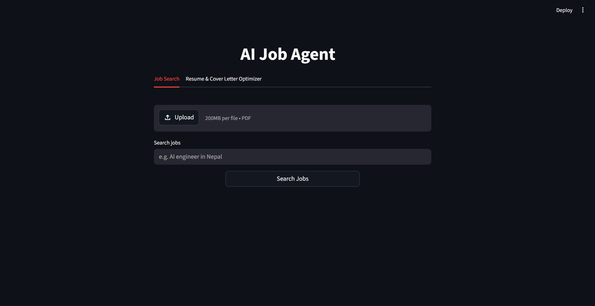
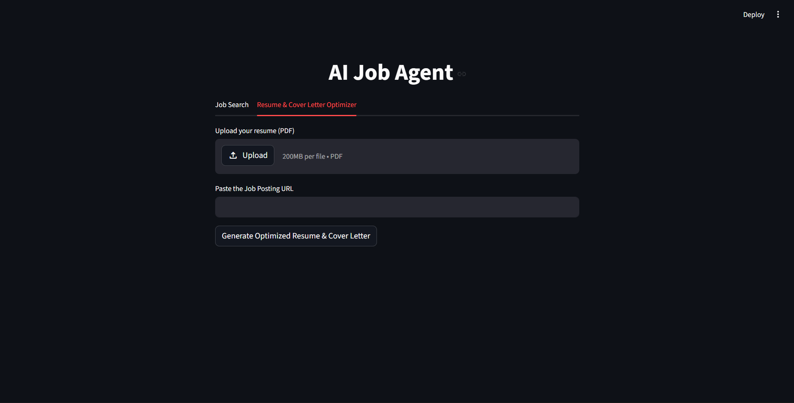

# 🚀 GenAI -> GenAI-Document-Agent

<div align="center">

[](https://github.com/sachinbudhamagar/GenAI-Document-Agent/stargazers)

[](https://github.com/sachinbudhamagar/GenAI-Document-Agent/network)

[](https://github.com/sachinbudhamagar/GenAI-Document-Agent/issues)

[](LICENSE) <!-- TODO: Add a LICENSE file (e.g., MIT, Apache 2.0) to clarify usage rights -->

**An intelligent Generative AI agent for document-based Q&A and personalized content generation, powered by LLMs.**

</div>

## 📖 Overview

The `GenAI-Document-Agent` project presents an interactive web application designed as a versatile Generative AI agent. Its core capability lies in processing and comprehending various documents, particularly PDFs like resumes and cover letters. Users can leverage this agent to engage in natural language conversations, extract information through questions, and generate customized content directly from the context of their uploaded documents. By integrating powerful Large Language Models (LLMs) from providers like OpenAI and Google, alongside advanced Retrieval Augmented Generation (RAG) techniques, `GenAI-Document-Agent` offers a potent solution for interactive document analysis and tailored content creation.

## ✨ Features

- **Document Upload & Analysis:** Easily upload and parse PDF documents, enabling the agent to analyze their content.
- **Multi-LLM Integration:** Seamlessly utilize cutting-edge LLMs from both OpenAI and Google Generative AI for diverse AI capabilities.
- **Contextual Q&A:** Ask specific questions related to your uploaded documents and receive accurate, contextually grounded answers via RAG.
- **Personalized Content Generation:** Generate new text, summaries, or modifications based on the information and style within your documents.
- **Intuitive Web Interface:** Interact with the GenAI-Document-Agent agent through a user-friendly and responsive Streamlit-powered web application.
- **Robust Vector Search:** Employs FAISS and ChromaDB for efficient storage and retrieval of document embeddings, ensuring precise information retrieval.
- **Flexible Configuration:** Simple environment variable setup using `.env` files for managing API keys and other settings.

## 🖥️ Screenshots

<!-- Example: -->

<!--  -->

<!--  -->

## 🛠️ Tech Stack

**Core Languages & Runtimes:**

[](https://www.python.org/)

**Web UI Framework:**

[](https://streamlit.io/)

**AI/ML & NLP Libraries:**

[](https://www.langchain.com/)

[](https://openai.com/)

[](https://ai.google.dev/)

[](https://huggingface.co/docs/transformers/index)

[](https://pytorch.org/)

**Vector Databases & Embeddings:**

[](https://github.com/facebookresearch/faiss)

[](https://www.trychroma.com/)

[](https://www.sbert.net/)

**Utilities & Data Handling:**

[](https://github.com/theskumar/python-dotenv)

[](https://pypdf.readthedocs.io/en/stable/)

[](https://extras.streamlit.app/)

## 🚀 Quick Start

Follow these steps to set up and run the GenAI-Document-Agent agent on your local machine.

### Prerequisites

- **Python 3.8+**
- **pip** (Python package installer, usually comes with Python)

### Installation

1. **Clone the repository**

    ```bash
    git clone https://github.com/sachinbudhamagar/GenAI-Document-Agent.git
    cd GenAI-Document-Agent
    ```

2. **Install dependencies**
    It's highly recommended to create and activate a virtual environment before installing dependencies.

    ```bash
    python -m venv venv
    source venv/bin/activate # On Windows use `venv\Scripts\activate`
    pip install -r requirements.txt
    ```

3. **Environment setup**
    Create a `.env` file in the project's root directory by copying the example provided. This file will store your essential API keys.

    ```bash
    cp .env.example .env
    ```

    Open the newly created `.env` file and populate it with your API keys:

    ```
    OPENAI_API_KEY="your_openai_api_key_here"
    GOOGLE_API_KEY="your_google_generative_ai_api_key_here"
    ```

    *Note: You need at least one of these API keys (`OPENAI_API_KEY` or `GOOGLE_API_KEY`) for the LLM features to function.*

4. **Start the Streamlit development server**

    ```bash
    streamlit run app.py
    ```

5. **Open your browser**
    The Streamlit application will typically open in your default browser. If not, visit `http://localhost:8501` (or the address displayed in your terminal).

## 📁 Project Structure

```
GenAI/
├── .gitignore            # Specifies intentionally untracked files and directories
├── app.py                # Main Streamlit application logic and entry point
├── requirements.txt      # Lists all Python dependencies required for the project
├── .env.example          # Template file for environment variables (e.g., API keys)
├── cover_letter.pdf      # Example PDF document, likely for testing or demonstration
├── optimized_resume.pdf  # Another example PDF document, possibly for specific RAG use cases
└── __pycache__/          # Directory for Python bytecode cache files
```

## ⚙️ Configuration

### Environment Variables

The application uses `python-dotenv` to load environment variables from a `.env` file located in the project's root.

| Variable          | Description                                                    | Required |

|-------------------|----------------------------------------------------------------|----------|

| `OPENAI_API_KEY`  | Your API key for accessing OpenAI's Large Language Models.     | Yes      |

| `GOOGLE_API_KEY`  | Your API key for accessing Google's Generative AI models.      | Yes      |

*At least one of `OPENAI_API_KEY` or `GOOGLE_API_KEY` must be provided for the LLM functionalities to work.*

## 🔧 Development

### Available Scripts

The primary command to run and interact with the application during development is:

| Command                   | Description                                          |

|---------------------------|------------------------------------------------------|

| `streamlit run app.py`    | Starts the Streamlit development server, hosting the GenAI-Document-Agent agent. |

### Development Workflow

1. Ensure you have followed the "Quick Start" steps to set up your environment and install dependencies.
2. Activate your virtual environment (`source venv/bin/activate`).
3. Modify `app.py` or any related Python modules. Streamlit provides hot-reloading for a seamless development experience.
4. Run `streamlit run app.py` to view changes in real-time in your browser.

## 🧪 Testing

While specific test files are not present in the provided repository structure, Python projects commonly utilize testing frameworks like `pytest` or `unittest`.

To implement and run tests:

1. Install a testing framework (e.g., `pip install pytest`).
2. Create a `tests/` directory and populate it with your test modules (e.g., `tests/test_agent.py`).
3. Execute tests from your project root:

    ```bash
    pytest
    ```

## 🚀 Deployment

Being a Streamlit application, the `GenAI-Document-Agent` agent offers several straightforward deployment options:

- **Streamlit Community Cloud:** The recommended and simplest method for deploying Streamlit applications. You can directly connect your GitHub repository for automated deployments.
- **Docker:** Create a `Dockerfile` to containerize your application, making it portable and deployable on any Docker-compatible environment, including cloud platforms (AWS EC2, Google Cloud Run), Kubernetes, or private servers.
- **Traditional Web Server:** For more control, deploy the Python application on a virtual private server (VPS) using production-ready web servers like Gunicorn, potentially fronted by Nginx.

## 🤝 Contributing

We welcome contributions to improve the `GenAI-Document-Agent` agent! If you're interested in contributing, please consider:

- Reporting bugs or suggesting new features through the [GitHub Issues](https://github.com/sachinbudhamagar/GenAI-Document-Agent/issues) page.
- Submitting pull requests for bug fixes, new functionalities, or documentation improvements.

### Development Setup for Contributors

Follow the "Quick Start" guide to set up your local development environment. Please ensure your code adheres to standard Python coding conventions and includes appropriate docstrings and comments for clarity.

## 📄 License

This project currently does not have an explicit license file. It is recommended to add a `LICENSE` file (e.g., MIT, Apache 2.0) to clearly define the terms under which the software can be used, modified, and distributed.

## 🙏 Acknowledgments

A special thanks to the creators and maintainers of the following powerful tools and libraries:

- **LangChain**: For enabling the development of robust LLM applications.
- **Streamlit**: For providing an incredible framework for building interactive web apps with ease.
- **OpenAI & Google Generative AI**: For their groundbreaking Large Language Models.
- **Hugging Face**: For the Transformers library and pre-trained models.
- **FAISS & ChromaDB**: For their high-performance vector search capabilities.
- **PyPDF2 & pypdf**: For essential PDF manipulation and extraction functionalities.

## 📞 Support & Contact

- 🐛 Issues: For bug reports or feature requests, please use [GitHub Issues](https://github.com/sachinbudhamagar/GenAI-Document-Agent/issues).
- 👨‍💻 Author: [Sachin Budhamagar](https://github.com/sachinbudhamagar)

---

<div align="center">

**⭐ Star this repo if you find it helpful!**

</div>
