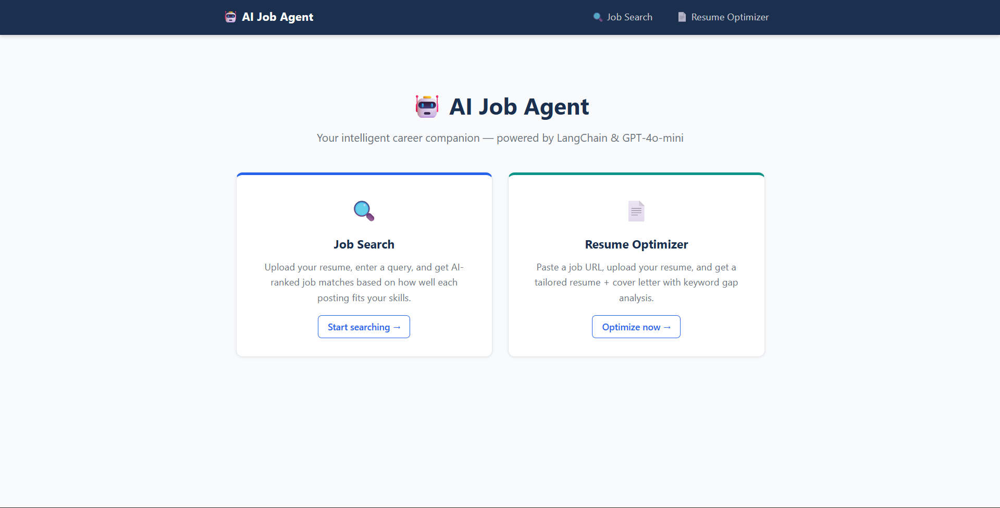
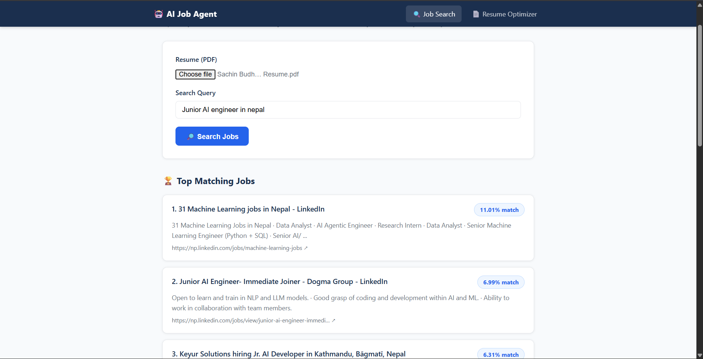

# 🤖 GenAI Document Agent — Django Edition

<div align="center">

[](https://github.com/sachinbudhamagar/GenAI-Document-Agent/stargazers)

[](https://github.com/sachinbudhamagar/GenAI-Document-Agent/network)

[](https://github.com/sachinbudhamagar/GenAI-Document-Agent/issues)

[](LICENSE) <!-- TODO: Add LICENSE file -->

**AI-powered job search and resume optimiser. Originally built with Streamlit, UI layer replaced with **Django** for a proper request/response web architecture.**

</div>


## 🖥️ Screenshots

 <!-- TODO: Add actual screenshots showcasing document interaction, API docs, etc. -->
_Example of a interaction interface with the GenAI Document Agent API._
<br/>

 <!-- TODO: Add a screenshot of the API documentation generated by DRF Spectacular -->
_Sample of Interactive job search result._

## 🛠️ Tech Stack

**Backend & AI:**

[](https://www.python.org/)

[](https://www.djangoproject.com/)

[](https://www.djangoproject.com/)

[](https://www.langchain.com/)

[](https://openai.com/)

**Vector Database:**

[](https://www.trychroma.com/)

[](https://github.com/facebookresearch/faiss)

**Development & Tools:**

[](https://pipenv.pypa.io/en/latest/)

[](https://docs.pytest.org/)

[](https://drf-spectacular.readthedocs.io/en/latest/)

## 🚀 Quick Start

Follow these steps to get the GenAI Document Agent up and running on your local machine.

### Prerequisites
-   **Python 3.11+**: Recommended version.
-   **pipenv**: For dependency management.
-   **OpenAI API Key**: Required for interacting with OpenAI models.

### Installation

1.  **Clone the repository**
    ```bash
    git clone https://github.com/sachinbudhamagar/GenAI-Document-Agent.git
    cd GenAI-Document-Agent
    ```

2.  **Install dependencies**
    ```bash
    pip install -r requirements.txt
    ```

3.  **Environment setup**
    Create a `.env` file in the project root:
    ```bash
    cp .env.example .env # If .env.example exists, copy it. Otherwise, create manually.
    ```
    Edit the `.env` file and configure your environment variables:
    ```ini
    # .env
    DEBUG=True
    SECRET_KEY='django-insecure-YOUR_SECRET_KEY' 
    ALLOWED_HOSTS='*' 

    # OpenAI API Key
    OPENAI_API_KEY='YOUR_OPENAI_API_KEY'
    ```
4.  **Database setup**
    Apply Django database migrations. By default, this project uses SQLite.
    ```bash
    pipenv run python manage.py migrate
    ```

5.  **Start development server**
    ```bash
    pipenv run python manage.py runserver
    ```
    This will start the Django development server on `http://127.0.0.1:8000/`.

## 📁 Project Structure

```
GenAI-Document-Agent/
├── manage.py                    # Django entry point
├── core/                        # Django project config
│   ├── settings.py
│   ├── urls.py
│   └── wsgi.py
├── web/                         # Django app (views, templates, static)
│   ├── views.py
│   ├── urls.py
│   ├── templates/web/
│   │   ├── base.html
│   │   ├── index.html
│   │   ├── job_search.html
│   │   └── resume_optimizer.html
│   └── static/web/
│       ├── css/main.css
│       └── js/main.js
├── src/                         # Business logic (unchanged)
│   ├── config.py
│   ├── services/
│   │   ├── job_search.py
│   │   ├── job_scorer.py
│   │   ├── job_scraper.py
│   │   ├── llm.py
│   │   └── resume_generator.py
│   └── utils/
│       ├── pdf.py
│       ├── text.py
│       └── decorators.py
├── tests/
├── requirements.txt
└── liscense
```
## Pages

| URL | Description |
|-----|-------------|
| `/` | Landing page |
| `/job-search/` | Upload resume + query → ranked job list |
| `/resume-optimizer/` | Paste job URL + resume → tailored resume & cover letter PDF |
| `/download/resume/` | Download optimized resume PDF |
| `/download/cover/` | Download cover letter PDF |

---

## Why Django instead of Streamlit?

| Concern | Streamlit | Django |
|---------|-----------|--------|
| Multiple users | Shared session state issues | Proper per-request isolation |
| URL routing | Single-page only | Full URL structure |
| HTML control | Limited widget API | Full template control |
| Deployment | Streamlit Cloud / manual | Any WSGI host (Heroku, Railway, VPS) |
| Testability | Hard to unit-test UI | Views are plain Python functions |

---

## Environment Variables

| Variable | Default | Description |
|---|---|---|
| `OPENAI_API_KEY` | — | Required |
| `SERPER_API_KEY` | — | Required |
| `LLM_MODEL` | `gpt-4o-mini` | OpenAI model |
| `DJANGO_SECRET_KEY` | insecure default | Set in production |
| `DJANGO_DEBUG` | `True` | Set to `False` in production |
| `DJANGO_ALLOWED_HOSTS` | `localhost 127.0.0.1` | Space-separated |

## 🚀 Deployment

### Production Build
While Django does not have a "build" step like frontend applications, preparing for production involves:

1.  **Installing dependencies for production:**
    ```bash
    pip install -r requirements.txt
    ```
2.  **Collecting static files (if serving any):**
    ```bash
    python manage.py collectstatic
    ```
3.  **Configuring a production-ready web server (e.g., Gunicorn, uWSGI) and a reverse proxy (e.g., Nginx, Apache).**
4.  **Setting up a robust database (e.g., PostgreSQL, MySQL).**
5.  **Ensuring all environment variables (`SECRET_KEY`, `DEBUG=False`, `ALLOWED_HOSTS`) are correctly configured.**

### Deployment Options

## Docker Setup
A `Dockerfile` is used for containerization.
**Build**
```bash
Build
    docker-compose build

Run 
    docker-compose up

Stop
    docker-compose down
```

### Authentication
Currently, the API likely uses token-based authentication (Django REST Framework's default or custom). Consult `core/settings.py` and API views for specific authentication classes.

### Development Setup for Contributors
-   Ensure you have Python 3.11+ and `pipenv` installed.
-   Follow the "Quick Start" installation steps.
-   Adhere to Python best practices and Django coding style.

## 📄 License

This project is licensed under the [MIT](LICENSE) - see the LICENSE file for details. <!-- TODO: Specify actual license and add LICENSE file -->

## 🙏 Acknowledgments

-   **Django** & **Django REST Framework**: For providing a robust backend framework.
-   **LangChain**: For enabling powerful LLM orchestration.
-   **OpenAI**: For cutting-edge generative AI models.
-   **ChromaDB** & **FAISS**: For efficient vector embeddings and search.
-   **unstructured-io/unstructured** & **PyPDF**: For document parsing and data extraction.

## 📞 Support & Contact

-   📧 Email: [sachinbmagar19@gmail.com]
-   🐛 Issues: [GitHub Issues](https://github.com/sachinbudhamagar/GenAI-Document-Agent/issues)

---

<div align="center">

**⭐ Star this repo if you find it helpful!**

Made by [Sachin Budhamagar](https://github.com/sachinbudhamagar)

</div>
